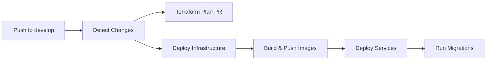
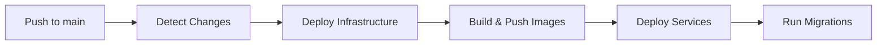

# CI/CD Pipeline Best Practices - Finspeed

## Overview

This document outlines the robust CI/CD pipeline implementation for the Finspeed project, following industry best practices for Terraform and GitHub Actions workflows.

## ✅ Implemented Improvements

### 1. Remote Backend with State Locking

**Problem Solved**: Prevents state corruption and concurrent modification issues.

**Implementation**:
- **Staging**: GCS backend `finspeed-st-tf-state` with prefix `staging`
- **Production**: GCS backend `finspeed-st-tf-state-prod` with prefix `production`
- Automatic state locking prevents concurrent applies
- Stale lock cleanup (15-minute timeout) for recovery

```hcl
terraform {
  backend "gcs" {
    bucket = "finspeed-st-tf-state"
    prefix = "staging"
  }
}
```

### 2. Workflow Concurrency Control

**Problem Solved**: Prevents parallel deployments that could conflict.

**Implementation**:
```yaml
concurrency:
  group: deploy-staging  # or deploy-production
  cancel-in-progress: false  # Queue runs instead of canceling
```

### 3. Comprehensive Validation Pipeline

**Problem Solved**: Catches errors early before expensive apply operations.

**Implementation**:
- `terraform fmt -check -recursive` - Code formatting validation
- `terraform validate` - Configuration syntax and logic validation  
- `terraform plan` - Infrastructure change preview
- Conditional apply only if plan succeeds

### 4. Enhanced Error Handling & Logging

**Problem Solved**: Better debugging and failure recovery.

**Implementation**:
- `TF_LOG: INFO` for detailed Terraform logging
- `set -euo pipefail` for strict error handling
- Plan files (`tfplan.out`) for reproducible applies
- Conditional steps with `if: steps.plan.outcome == 'success'`

### 5. Version Pinning for Consistency

**Problem Solved**: Prevents unexpected behavior from version drift.

**Implementation**:
- Terraform version pinned to `1.5.7`
- GitHub Actions pinned to specific SHA commits
- Provider versions locked in `.terraform.lock.hcl`

### 6. Input Validation & Type Safety

**Problem Solved**: Prevents runtime errors from invalid configurations.

**Implementation**:
```hcl
variable "project_id" {
  type        = string
  description = "GCP project ID"
  validation {
    condition     = can(regex("^[a-z][a-z0-9-]{4,28}[a-z0-9]$", var.project_id))
    error_message = "Project ID must be 6-30 characters, start with lowercase letter, contain only lowercase letters, numbers, and hyphens."
  }
}
```

**Validated Fields**:
- Project IDs (GCP format compliance)
- Domain names (FQDN format)
- Email addresses (RFC compliant)
- Container images (registry/repo:tag format)
- Resource limits (min/max ranges)
- Time formats (HH:MM for backups)

## 🔄 Workflow Architecture

### Staging Pipeline (`develop` branch)



### Production Pipeline (`main` branch)



## 🛡️ Security & Best Practices

### 1. Workload Identity Federation
- Keyless authentication using OIDC
- No long-lived service account keys
- Repository and branch restrictions

### 2. Least Privilege Access
- Environment-specific service accounts
- Minimal required permissions
- IAP protection for admin interfaces

### 3. Secret Management
- All credentials via GitHub Secrets
- No hardcoded values in workflows
- Automatic secret masking in logs

### 4. Resource Protection
- Deletion protection for critical resources
- Backup strategies for databases
- Staged deployments (staging → production)

## 📊 Monitoring & Observability

### 1. Pipeline Monitoring
- Terraform plan comments on PRs
- Detailed logging with `TF_LOG: INFO`
- Build artifacts for debugging
- Workflow status notifications

### 2. Infrastructure Monitoring
- Uptime checks for critical services
- Database backup verification
- SSL certificate monitoring
- Resource utilization alerts

## 🚀 Deployment Strategy

### 1. GitFlow Model
- `develop` branch → Staging environment
- `main` branch → Production environment
- Feature branches for development
- Pull request reviews required

### 2. Progressive Deployment
1. **Infrastructure First**: Deploy Terraform changes
2. **Build Images**: Create container images if needed
3. **Deploy Services**: Update Cloud Run services
4. **Run Migrations**: Execute database changes
5. **Verify Health**: Automated health checks

### 3. Rollback Strategy
- Container image tags for quick rollbacks
- Database migration rollback procedures
- Infrastructure state recovery via Terraform
- Blue-green deployment capability

## 🔧 Troubleshooting Guide

### Common Issues & Solutions

#### 1. Terraform State Lock Issues
```bash
# Clean up stale locks (automated in pipeline)
gsutil rm gs://finspeed-st-tf-state/staging/default.tflock
```

#### 2. Plan/Apply Failures
- Check `TF_LOG: DEBUG` output in artifacts
- Verify variable validations passed
- Ensure proper IAM permissions
- Review resource dependencies

#### 3. Container Build Failures
- Verify Dockerfile syntax
- Check build context and file paths
- Ensure Artifact Registry permissions
- Review build logs in GitHub Actions

#### 4. Migration Failures
- Check database connectivity
- Verify migration job permissions
- Review Cloud Run job logs
- Ensure proper image tags

## 📋 Maintenance Tasks

### Weekly
- [ ] Review failed workflow runs
- [ ] Check Terraform state consistency
- [ ] Verify backup completion
- [ ] Update dependency versions (if needed)

### Monthly
- [ ] Audit IAM permissions
- [ ] Review resource utilization
- [ ] Update documentation
- [ ] Test disaster recovery procedures

### Quarterly
- [ ] Terraform provider updates
- [ ] Security vulnerability scans
- [ ] Performance optimization review
- [ ] Cost optimization analysis

## 🎯 Key Metrics

### Pipeline Health
- **Success Rate**: Target >95%
- **Mean Time to Deployment**: <15 minutes
- **Mean Time to Recovery**: <30 minutes
- **Change Failure Rate**: <5%

### Infrastructure Health
- **Uptime**: Target >99.9%
- **Response Time**: <500ms p95
- **Error Rate**: <1%
- **Database Backup Success**: 100%

## 🔮 Future Improvements

### Planned Enhancements
1. **Automated Testing**: Integration and E2E tests in pipeline
2. **Canary Deployments**: Gradual rollout with traffic splitting
3. **Policy as Code**: Open Policy Agent (OPA) for compliance
4. **Cost Monitoring**: Automated cost alerts and optimization
5. **Multi-Region**: Cross-region disaster recovery setup

### Technical Debt
1. **IAP Brand Deprecation**: Migrate to new IAP APIs before July 2025
2. **Container Security**: Implement vulnerability scanning
3. **Secrets Rotation**: Automated credential rotation
4. **Compliance**: SOC2/ISO27001 preparation

---

## 📞 Support

For pipeline issues or questions:
- **Primary**: GitHub Issues in repository
- **Emergency**: Direct contact with DevOps team
- **Documentation**: This file and inline code comments

**Last Updated**: 2025-01-23
**Version**: 2.0.0
**Maintainer**: DevOps Team
