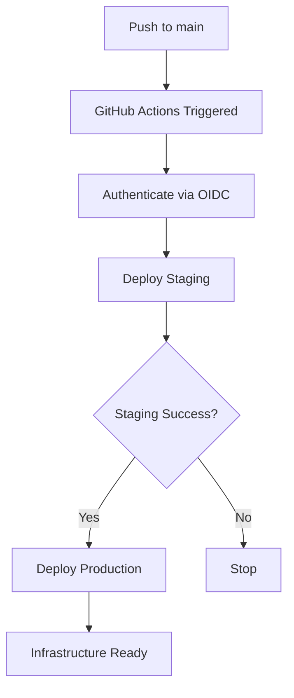

# GitHub OIDC/Workload Identity Setup Guide

This guide sets up secure, keyless authentication from GitHub Actions to Google Cloud Platform using Workload Identity Federation.

## 🔐 Benefits of Workload Identity Federation

- **No service account keys** - Eliminates key management and rotation
- **Short-lived tokens** - Automatic token expiration for enhanced security  
- **Principle of least privilege** - Fine-grained access control
- **Audit trail** - Complete visibility into authentication events
- **GitHub native** - Seamless integration with GitHub Actions

## 🚀 Quick Setup

### Step 1: Authenticate with GCP

First, you need to authenticate with Google Cloud:

```bash
# Try the verification code approach first
gcloud auth login --no-launch-browser
# Use the verification code you provided earlier: 4/0AVMBsJgRNqvTv8u4HN8S6G8v0jstru-wML3kEIiaZb0SoS3FaxCWdny8e5WXsb0414mSdg

# OR if browser is available
gcloud auth login
```

### Step 2: Run Workload Identity Setup

```bash
cd /home/dekisuki/finspeed/infra
chmod +x setup-workload-identity.sh
./setup-workload-identity.sh
```

### Step 3: Configure GitHub Repository

The script will create a GitHub Actions workflow file. You need to:

1. **Commit and push** the generated `.github/workflows/deploy-infrastructure.yml`
2. **Set up GitHub environments**:
   - Go to your GitHub repo → Settings → Environments
   - Create `staging` and `production` environments
   - Add protection rules (require reviews for production)

### Step 4: Deploy Infrastructure

Once setup is complete, infrastructure deploys automatically:

- **Push to main/master** → Triggers staging deployment
- **Staging success** → Triggers production deployment (with approval)
- **Manual trigger** → Use GitHub Actions "Run workflow" button

## 🏗️ What Gets Created

### GCP Resources (per project):

- **Workload Identity Pool**: `github-actions-pool`
- **OIDC Provider**: `github-actions-provider` 
- **Service Accounts**: 
  - `github-actions-sa-staging@finspeed-staging.iam.gserviceaccount.com`
  - `github-actions-sa-prod@finspeed-prod.iam.gserviceaccount.com`
- **IAM Roles**: Editor, Cloud SQL Admin, Cloud Run Admin, etc.

### GitHub Actions Workflow:

- **Automatic deployment** on code changes
- **Environment protection** for production
- **Terraform state management**
- **Output display** for connection details

## 🔧 Configuration

The script uses these defaults (you can modify in the script):

```bash
GITHUB_REPO="sunderam-tripathi/finspeed"
PROJECT_STAGING="finspeed-staging"  
PROJECT_PROD="finspeed-prod"
```

## 🎯 Deployment Flow



## 🔍 Troubleshooting

### Authentication Issues

```bash
# Check current authentication
gcloud auth list

# Re-authenticate if needed
gcloud auth login
```

### Workload Identity Issues

```bash
# Check workload identity pools
gcloud iam workload-identity-pools list --location=global

# Check service accounts
gcloud iam service-accounts list
```

### GitHub Actions Issues

- Verify repository name matches exactly
- Check environment protection rules
- Ensure OIDC provider is correctly configured

## 📊 Security Features

- **Zero long-lived credentials** stored in GitHub
- **Automatic token rotation** via OIDC
- **Repository-scoped access** - only your repo can authenticate
- **Environment-based isolation** - staging/prod separation
- **Audit logging** - all actions tracked in GCP

## 🔗 Next Steps After Setup

1. **Verify deployment** in Google Cloud Console
2. **Test the workflow** with a small change
3. **Configure monitoring** alerts and dashboards  
4. **Set up application deployment** to Cloud Run
5. **Configure domain and SSL** for production

## 📚 References

- [Workload Identity Federation](https://cloud.google.com/iam/docs/workload-identity-federation)
- [GitHub OIDC](https://docs.github.com/en/actions/deployment/security-hardening-your-deployments/about-security-hardening-with-openid-connect)
- [Google GitHub Actions](https://github.com/google-github-actions/auth)
